# Database Schema Documentation

Database engine: **MariaDB 10.6+ / MySQL 8.0+** (`emergencydb`).  
Schema source: `backend/database/migrations/` and `database/emergencydb.sql`.

---

## 1. Entity-Relationship (ER) Diagram

```mermaid
erDiagram
    BARANGAYS ||--o{ USER_PROFILES : "resides in"
    BARANGAYS ||--o{ EMERGENCY_REQUESTS : "located in"
    BARANGAYS ||--o{ HAZARDS : "located in"
    BARANGAYS ||--o{ BROADCAST_BARANGAYS : "targeted by"
    BROADCASTS ||--o{ BROADCAST_BARANGAYS : "scoped to"
    USERS ||--o| USER_PROFILES : "owns"
    USERS ||--o{ USER_VERIFICATIONS : "submits"
    USERS ||--o| USER_MEDICAL_PROFILES : "has"
    USERS ||--o{ EMERGENCY_REQUESTS : "files"
    USERS ||--o{ HAZARDS : "reports"
    USERS ||--o{ FEEDBACK : "submits"
    USERS ||--o{ DEVICE_TOKENS : "registers"
    USERS ||--o{ USER_SETTINGS : "configures"
    INCIDENT_TYPES ||--o{ EMERGENCY_REQUESTS : "categorizes"
    EMERGENCY_REQUESTS ||--o{ DISPATCH : "triggers"
    RESPONDERS ||--o{ DISPATCH : "assigned to"
    RESPONDERS ||--o{ VEHICLES : "operates"
    VEHICLES ||--o{ DISPATCH : "utilized in"

    BARANGAYS {
        int barangay_id PK
        varchar barangay_name
    }
    USERS {
        int user_id PK
        varchar email UK
        varchar password
        enum role
        enum account_status
        tinyint false_alarm_strikes
        string ban_reason
        timestamp banned_at
    }
    USER_PROFILES {
        int profile_id PK
        int user_id FK
        varchar first_name
        varchar last_name
        varchar username UK
        varchar phone
        date birthdate
        varchar profile_picture
        int barangay_id FK
        boolean setup_completed
    }
    USER_VERIFICATIONS {
        int verification_id PK
        int user_id FK
        varchar valid_id_type
        varchar valid_id_number
        date valid_id_expiry
        json valid_id_details
        varchar valid_id_proof
        varchar valid_id_proof_back
        varchar selfie_with_id_proof
        enum verification_status
        varchar rejection_reason
        int reviewed_by FK
        timestamp reviewed_at
    }
    USER_MEDICAL_PROFILES {
        int profile_id PK
        int user_id FK
        varchar blood_type
        text allergies
        text medical_conditions
        varchar pwd_status
    }
    INCIDENT_TYPES {
        int incident_type_id PK
        varchar incident_name
    }
    EMERGENCY_REQUESTS {
        int request_id PK
        int user_id FK
        int incident_type_id FK
        int barangay_id FK
        longtext proof_files
        text description
        decimal latitude
        decimal longitude
        varchar status
        boolean is_false_alarm
        timestamp request_time
    }
    HAZARDS {
        int hazard_id PK
        int user_id FK
        int barangay_id FK
        varchar description
        varchar hazard_type
        longtext proof_files
        decimal latitude
        decimal longitude
        varchar status
    }
    DISPATCH {
        int dispatch_id PK
        int request_id FK
        int responder_id FK
        int vehicle_id FK
        datetime dispatch_time
        datetime arrival_time
        varchar status
    }
    RESPONDERS {
        int responder_id PK
        varchar name
        varchar role
        varchar contact
        varchar status
    }
    VEHICLES {
        int vehicle_id PK
        int responder_id FK
        varchar name
        varchar type
        varchar plate
        varchar status
    }
    BROADCASTS {
        int broadcast_id PK
        varchar title
        text message
        longtext media_files
        tinyint is_active
        timestamp created_at
    }
    BROADCAST_BARANGAYS {
        int broadcast_id FK
        int barangay_id FK
    }
    FEEDBACK {
        bigint id PK
        int user_id FK
        text message
        varchar category
        timestamp created_at
    }
    DEVICE_TOKENS {
        int id PK
        int user_id FK
        varchar token
        varchar platform
        timestamp created_at
    }
    USER_SETTINGS {
        bigint id PK
        int user_id FK
        varchar key
        varchar value
        timestamp updated_at
    }
```

---

## 2. Detailed Table Specifications

### 2.1 `users`
Primary user table storing Identity & Access Management (IAM) credentials, roles, and account lifecycle status. Normalized to 3NF — demographic details live in `user_profiles`, identity verification documents live in `user_verifications`, and health information lives in `user_medical_profiles`.

| Column | Type | Nullable | Description & Constraints |
|---|---|---|---|
| `user_id` | `int` | No | Primary Key, Auto Increment |
| `email` | `varchar(100)` | Yes | Unique contact & OTP email |
| `password` | `varchar(255)` | Yes | Bcrypt password hash |
| `role` | `enum('citizen','dispatcher','admin')` | No | Access tier (default `'citizen'`) |
| `account_status` | `enum('unverified','active','banned')` | No | Account lifecycle status |
| `false_alarm_strikes`| `tinyint unsigned` | No | Accumulated confirmed false alarm strikes (3 = Auto-Ban) |
| `ban_reason` | `varchar(500)` | Yes | Reason recorded upon suspension |
| `banned_at` | `timestamp` | Yes | Suspension timestamp |
| `created_at` / `updated_at` | `timestamp` | Yes | Audit timestamps |
| `deleted_at` | `timestamp` | Yes | Soft-delete timestamp |

---

### `user_profiles`

Stores citizen and personnel demographic details, contact information, residence, and avatar image. Decoupled from core authentication to maintain clean separation of concerns between security credentials and personal identity.

| Column | Type | Nullable | Description & Constraints |
|---|---|---|---|
| `profile_id` | `int` | No | Primary Key, Auto Increment |
| `user_id` | `int` | No | Foreign Key → `users.user_id` (CASCADE DELETE, UNIQUE) |
| `first_name` | `varchar(100)` | Yes | Citizen / Officer given name |
| `last_name` | `varchar(100)` | Yes | Citizen / Officer surname |
| `username` | `varchar(50)` | Yes | Unique login handle |
| `phone` | `varchar(20)` | Yes | Normalized Philippine mobile number (`639...`) |
| `birthdate` | `date` | Yes | Date of birth (age verification) |
| `profile_picture` | `varchar(255)` | Yes | Storage URL to avatar image |
| `barangay_id` | `int` | Yes | Foreign Key → `barangays.barangay_id` |
| `setup_completed` | `boolean` | No | Indicates completion of post-approval onboarding wizard |
| `created_at` / `updated_at` | `timestamp` | Yes | Audit timestamps |

---

### `user_verifications`

Stores identity verification documents and review states submitted by citizens during registration. Allows re-submissions upon rejection without wiping previous audit trails, and keeps staff accounts free of null columns.

| Column | Type | Nullable | Description & Constraints |
|---|---|---|---|
| `verification_id` | `int` | No | Primary Key, Auto Increment |
| `user_id` | `int` | No | Foreign Key → `users.user_id` (CASCADE DELETE) |
| `valid_id_type` | `varchar(50)` | Yes | Document type (PhilSys, Driver's License, Passport, UMID, Postal ID, PRC) |
| `valid_id_number` | `varchar(100)` | Yes | Formatted government ID number |
| `valid_id_expiry` | `date` | Yes | Expiration date (where applicable) |
| `valid_id_details` | `json` | Yes | Structured metadata (e.g. `{ profession: "..." }`) |
| `valid_id_proof` | `varchar(255)` | Yes | Front of government-issued ID image URL |
| `valid_id_proof_back`| `varchar(255)` | Yes | Back of government-issued ID image URL |
| `selfie_with_id_proof`| `varchar(255)` | Yes | Live selfie holding ID card |
| `verification_status` | `enum('pending','approved','rejected')` | No | Default `'pending'` |
| `rejection_reason` | `varchar(500)` | Yes | Reason recorded by reviewing officer |
| `reviewed_by` | `int` | Yes | Foreign Key → `users.user_id` (Admin/Dispatcher) |
| `reviewed_at` | `timestamp` | Yes | Verification timestamp |
| `created_at` / `updated_at` | `timestamp` | Yes | Submission audit timestamps |

---

### `user_medical_profiles`

Stores critical "Golden Minute" emergency medical and disability information. Segregated from core credentials for enhanced medical data privacy and emergency paramedic fast-retrieval.

| Column | Type | Nullable | Description & Constraints |
|---|---|---|---|
| `profile_id` | `int` | No | Primary Key, Auto Increment |
| `user_id` | `int` | No | Foreign Key → `users.user_id` (CASCADE DELETE, UNIQUE) |
| `blood_type` | `varchar(10)` | Yes | Medical profile: A+, B+, O+, AB+, etc. |
| `allergies` | `text` | Yes | Medical profile: Drug & environmental allergies |
| `medical_conditions` | `text` | Yes | Medical profile: Hypertension, Asthma, Diabetes, etc. |
| `pwd_status` | `varchar(100)` | Yes | Medical profile: PWD ID or assistance requirements |
| `created_at` / `updated_at` | `timestamp` | Yes | Profile update timestamps |

---

### 2.2 `barangays`
Reference table for the 9 official barangays comprising the Municipality of San Isidro, Nueva Ecija.

| Column | Type | Nullable | Notes |
|---|---|---|---|
| `barangay_id` | `int` | No | Primary Key |
| `barangay_name` | `varchar(255)` | No | Alua, Calaba, Malapit, Mangga, Poblacion, Pulo, San Roque, Santo Cristo, Tabon |

---

### 2.3 `emergency_requests`
Stores one-tap SOS emergency filings from citizens.

| Column | Type | Nullable | Notes |
|---|---|---|---|
| `request_id` | `int` | No | Primary Key, Auto Increment |
| `user_id` | `int` | Yes | FK → `users.user_id` |
| `incident_type_id` | `int` | Yes | FK → `incident_types.incident_type_id` |
| `barangay_id` | `int` | Yes | FK → `barangays.barangay_id` (Authoritatively resolved by `BarangayResolver`) |
| `proof_files` | `longtext` (JSON) | Yes | JSON array of storage paths for live SOS camera photo/10s video |
| `description` | `text` | Yes | Citizen-provided incident details |
| `latitude` / `longitude` | `decimal(10,8)` / `(11,8)` | Yes | Precise GPS coordinates |
| `status` | `varchar(50)` | Yes | `'Pending'`, `'Dispatched'`, `'Resolved'`, `'Cancelled'` |
| `is_false_alarm` | `boolean` | No | Default `false`; set to `true` on confirmed false alarm mark |
| `request_time` | `timestamp` | No | Incident timestamp |

---

### 2.4 `hazards`
Citizen-reported public road hazards (floods, fallen trees, electrical hazards).

| Column | Type | Nullable | Notes |
|---|---|---|---|
| `hazard_id` | `int` | No | Primary Key, Auto Increment |
| `user_id` | `int` | Yes | FK → `users.user_id` |
| `barangay_id` | `int` | Yes | FK → `barangays.barangay_id` (Resolved by `BarangayResolver`) |
| `description` | `varchar(255)` | Yes | Details of the obstruction |
| `hazard_type` | `varchar(50)` | Yes | `'Flooded Street'`, `'Road Obstruction'`, `'Fallen Tree'`, `'Downed Wire'`, `'Others'` |
| `proof_files` | `longtext` (JSON) | Yes | JSON array of photo/video evidence paths |
| `latitude` / `longitude` | `decimal(10,8)` / `(11,8)` | Yes | Hazard location coordinates |
| `status` | `varchar(50)` | Yes | `'Active'`, `'Resolved'` |

---

### 2.5 `dispatch`
Links emergency requests to assigned responder teams and vehicles.

| Column | Type | Nullable | Notes |
|---|---|---|---|
| `dispatch_id` | `int` | No | Primary Key, Auto Increment |
| `request_id` | `int` | No | FK → `emergency_requests.request_id` |
| `responder_id`| `int` | No | FK → `responders.responder_id` |
| `vehicle_id`  | `int` | No | FK → `vehicles.vehicle_id` |
| `dispatch_time`| `datetime` | Yes | Timestamp when units were dispatched |
| `arrival_time` | `datetime` | Yes | Timestamp when units arrived/completed |
| `status`      | `varchar(50)` | Yes | `'En Route'`, `'Completed'` |

---

### 2.6 `responders` & `vehicles`
Municipal response units and their linked emergency vehicle fleets.

- **`responders`**: San Isidro BFP (Firefighter), San Isidro PNP (Police), MDRRMO Rescue Team (Rescue), Rural Health Unit — RHU (Medical).
- **`vehicles`**: Ambulances, Fire Trucks, Patrol Cars, Rescue Boats, Utility Trucks (linked to specific `responder_id`).

---

### 2.7 `broadcasts` & `broadcast_barangays`
Emergency alert banners pushed by dispatchers/admins.

- **`broadcasts`**: Contains `broadcast_id`, `title`, `message`, `media_files` (JSON array of up to 4 images/videos), `is_active` (`1` or `0`), and `created_at`.
- **`broadcast_barangays`**: Pivot table (`broadcast_id`, `barangay_id`). If empty, the broadcast is treated as **Town-wide**; otherwise, it is scoped exclusively to citizens registered in the selected barangays.

---

### 2.8 `user_settings`
Flexible key-value preferences table with unique constraint on `(user_id, key)`.

Supported Keys:
- `dark_mode`: `'true'` / `'false'` (Default `'false'`)
- `reduce_animations`: `'true'` / `'false'` (Default `'false'`)
- `location_auto_fetch`: `'true'` / `'false'` (Default `'true'`)
- `map_default_style`: `'street'` / `'satellite'` (Default `'street'`)
- `notif_emergency_alerts`: `'true'` / `'false'` (Default `'true'`)
- `notif_broadcast_alerts`: `'true'` / `'false'` (Default `'true'`)
- `save_media_to_device`: `'true'` / `'false'` (Default `'false'`)
- `photo_cropping_enabled`: `'true'` / `'false'` (Default `'true'`)
- `video_trimming_enabled`: `'true'` / `'false'` (Default `'true'`)
