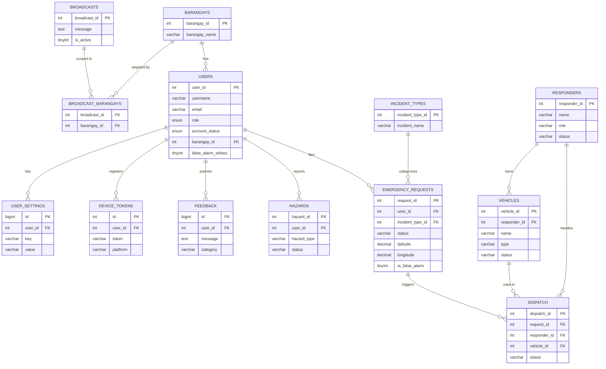

# Database Schema

Database: `emergencydb` (MariaDB / MySQL). Schema source: `database/emergencydb.sql`.

## ER Diagram

> GitHub renders this diagram automatically — no extra setup needed to view it.

## Tables

<b>users</b>

| Column | Type | Notes |
|---|---|---|
| `user_id` | `int` PK, auto-increment | |
| `first_name`, `last_name`, `username` | `varchar` | |
| `phone`, `birthdate` | `varchar`, `date` | |
| `profile_picture` | `varchar` | defaults to a placeholder avatar URL |
| `email` | `varchar` | |
| `password` | `varchar` | bcrypt hash |
| `role` | `enum('citizen','dispatcher','admin')` | default `citizen` |
| `account_status` | `enum('unverified','active','banned')` | default `active`; new citizen registrations are created as `unverified` explicitly (see `AuthController::register()`) and stay locked out of login until an admin approves them |
| `barangay_id` | `int` FK → `barangays.barangay_id` | |
| `valid_id_proof`, `valid_id_type`, `selfie_with_id_proof` | `varchar` | ID check during registration |
| `blood_type`, `allergies`, `medical_conditions`, `pwd_status` | `varchar`/`text` | "Golden Minute" medical profile, attached to SOS |
| `ban_reason`, `banned_at` | `varchar`, `timestamp` | account moderation |
| `false_alarm_strikes` | `tinyint unsigned` | counts confirmed false-alarm SOS reports per user |
| `created_at`, `updated_at`, `deleted_at` | `timestamp` | soft-deletes supported |

<b>barangays</b>

| Column | Type |
|---|---|
| `barangay_id` | `int` PK |
| `barangay_name` | `varchar` |

Seeded with San Isidro's 9 barangays (Alua, Calaba, Malapit, Mangga, Poblacion, Pulo, San Roque, Santo Cristo, Tabon). Used both for a user's home barangay (`users.barangay_id`) and for scoping broadcasts (`broadcast_barangays`).

<b>incident_types</b>

| Column | Type |
|---|---|
| `incident_type_id` | `int` PK |
| `incident_name` | `varchar` |

Seeded values: Fire, Flood, Medical, Crime, Others.

<b>emergency_requests</b>

| Column | Type | Notes |
|---|---|---|
| `request_id` | `int` PK, auto-increment | |
| `user_id` | `int` FK → `users.user_id` | |
| `incident_type_id` | `int` FK → `incident_types.incident_type_id` | |
| `proof_files` | `longtext` (JSON) | validated with `CHECK (json_valid(...))`; list of storage paths to SOS photo/video proof |
| `description` | `text` | |
| `latitude`, `longitude` | `decimal(10,8)` / `decimal(11,8)` | |
| `status` | `varchar` | e.g. `Cancelled`, `Resolved` |
| `is_false_alarm` | `tinyint(1)` | |
| `request_time`, `created_at`, `updated_at`, `deleted_at` | `timestamp` | soft-deletes supported |

<b>hazards</b>

| Column | Type | Notes |
|---|---|---|
| `hazard_id` | `int` PK, auto-increment | |
| `user_id` | `int` FK → `users.user_id` | |
| `description`, `hazard_type` | `varchar` | e.g. "Flooded Street" |
| `proof_files` | `longtext` (JSON, `json_valid` checked) | photo/video proof |
| `latitude`, `longitude` | `decimal` | |
| `status` | `varchar` | default `Active` |

<b>dispatch</b>

| Column | Type | Notes |
|---|---|---|
| `dispatch_id` | `int` PK, auto-increment | |
| `request_id` | `int` FK → `emergency_requests.request_id` | |
| `responder_id` | `int` FK → `responders.responder_id` | |
| `vehicle_id` | `int` FK → `vehicles.vehicle_id` | |
| `dispatch_time`, `arrival_time` | `datetime` | |
| `status` | `varchar` | e.g. `Completed` |

<b>responders</b>

| Column | Type |
|---|---|
| `responder_id` | `int` PK |
| `name`, `role`, `contact`, `status` | `varchar` |

Seeded units: San Isidro BFP (Firefighter), San Isidro PNP (Police), MDRRMO Rescue Team (Rescue), Rural Health Unit — RHU (Medical).

<b>vehicles</b>

| Column | Type | Notes |
|---|---|---|
| `vehicle_id` | `int` PK, auto-increment | |
| `responder_id` | `int` FK → `responders.responder_id` | |
| `name`, `type`, `plate`, `status` | `varchar` | |

<b>broadcasts</b>

| Column | Type |
|---|---|
| `broadcast_id` | `int` PK |
| `message` | `text` |
| `is_active` | `tinyint(1)`, default `1` |
| `created_at` | `timestamp` |

A broadcast with no rows in `broadcast_barangays` is **town-wide**; one or more rows there scopes it to those barangays (`Broadcast::isTownWide()` checks this). Multiple broadcasts can be active at once.

<b>broadcast_barangays</b>

| Column | Type |
|---|---|
| `broadcast_id` | `int` FK → `broadcasts.broadcast_id` |
| `barangay_id` | `int` FK → `barangays.barangay_id` |

Pivot table for many-to-many broadcast ↔ barangay targeting. A broadcast with zero rows here is town-wide.

<b>feedback</b>

| Column | Type |
|---|---|
| `id` | `bigint unsigned` PK |
| `user_id` | `int` FK → `users.user_id` (cascade delete) |
| `message` | `text` |
| `category` | `varchar`, default `general` |
| `created_at` | `timestamp` |

<b>device_tokens</b>

| Column | Type | Notes |
|---|---|---|
| `id` | `int` PK | |
| `user_id` | `int` FK → `users.user_id` (cascade delete) | |
| `token` | `varchar` | FCM push token |
| `platform` | `varchar`, default `android` | |

<b>user_settings</b>

| Column | Type |
|---|---|
| `id` | `bigint unsigned` PK |
| `user_id` | `int` FK → `users.user_id` (cascade delete) |
| `key`, `value` | `varchar` |
| `save_media_to_device` | `tinyint(1)` |

Stores per-user preferences as key/value pairs (`dark_mode`, `location_auto_fetch`, `map_default_style`, `reduce_animations`, etc.) instead of one column per setting.

<b>Laravel framework tables</b> (not app data)

`cache`, `cache_locks`, `jobs`, `job_batches`, `failed_jobs`, `migrations`, `sessions`, `password_reset_tokens`, `personal_access_tokens` — standard Laravel infrastructure tables.

## Seed Data

`database/emergencydb.sql` currently ships as a **full data dump**, not just the schema — it includes sample citizen accounts, bcrypt password hashes, real-looking emails/phone numbers, and live FCM push tokens from testing.

**Before this repo goes anywhere public or gets shown to a panel:** swap this file for a schema-only export (`mysqldump --no-data`) plus a small, made-up seed set, or scrub the real personal data and tokens out of the current dump. Shipping real push tokens and password hashes in a public repo is a risk even though the passwords are hashed.
